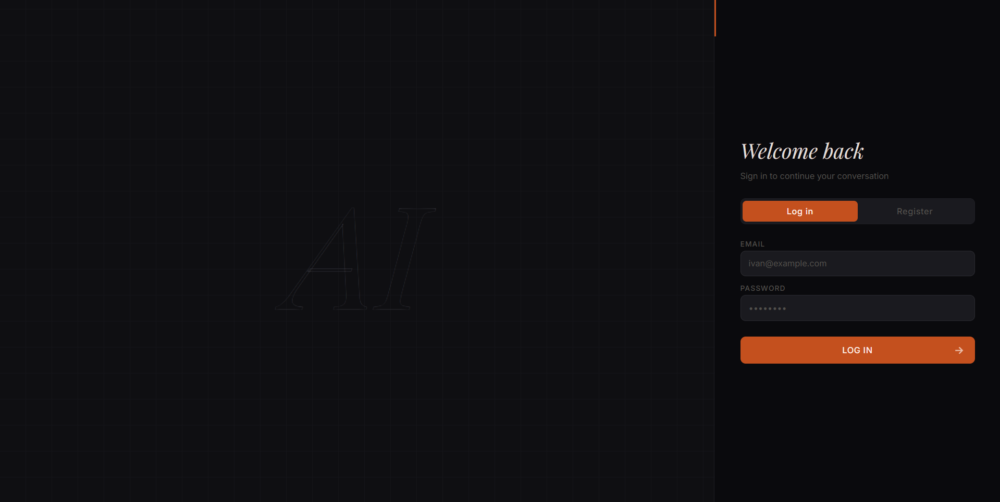
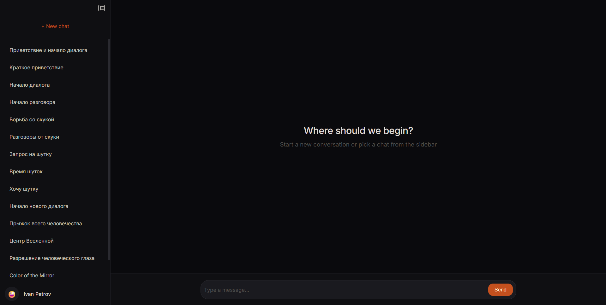
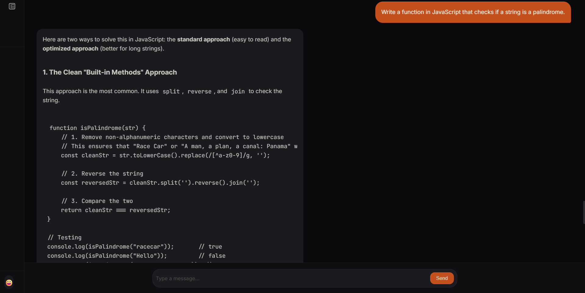
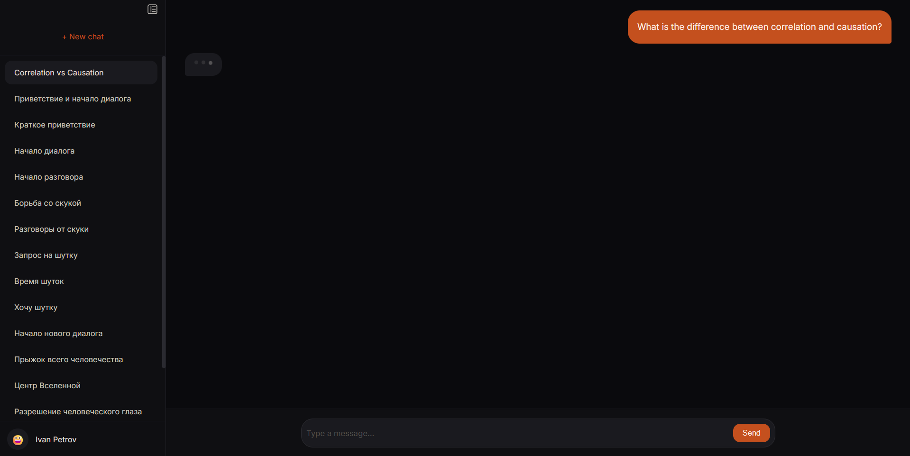
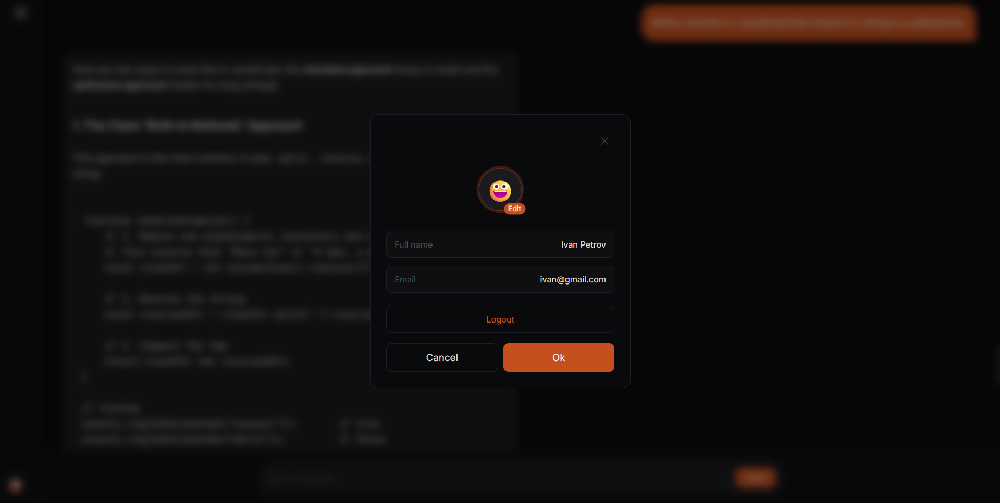
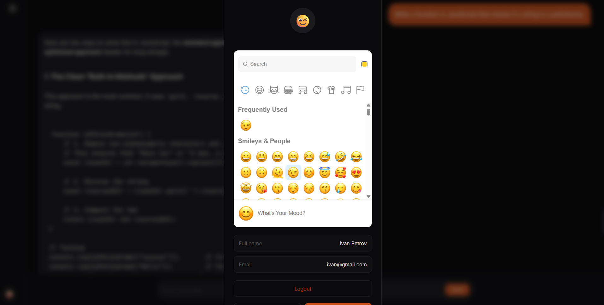
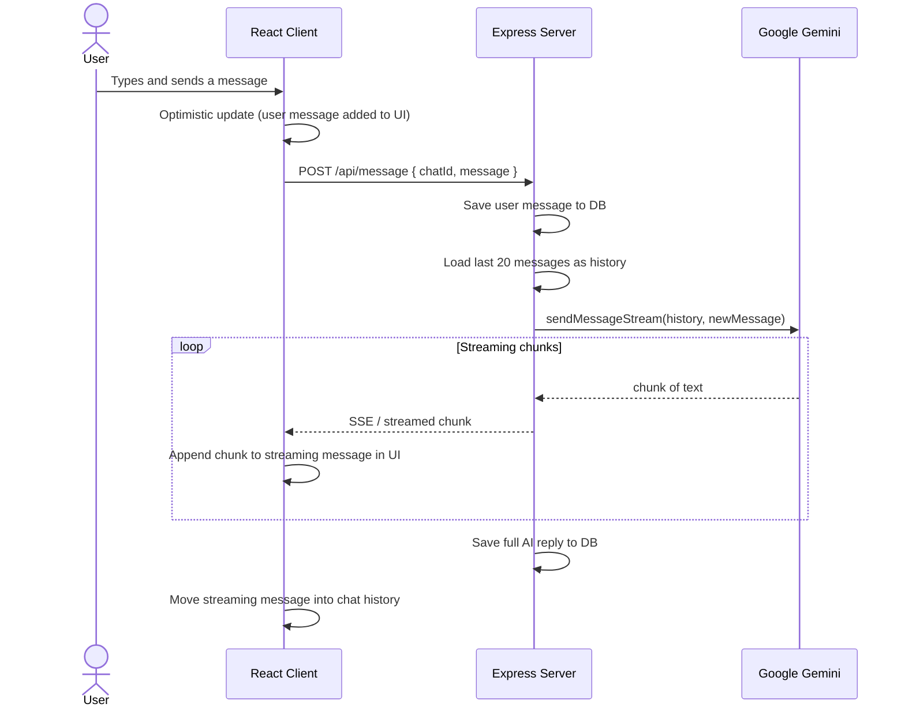
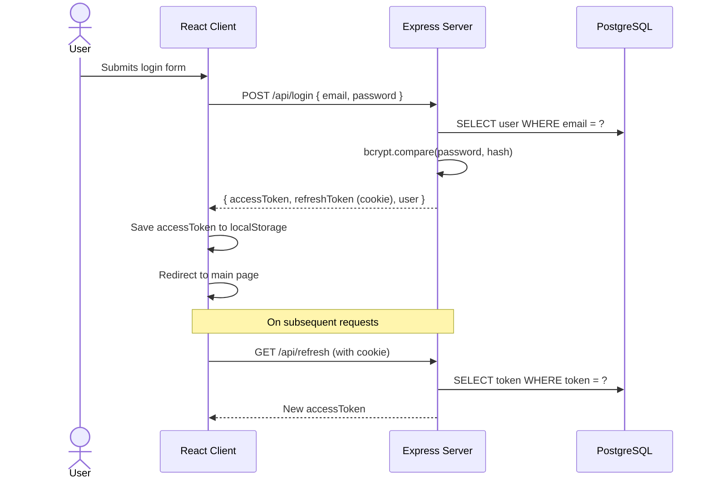

# AiChat


An AI-powered chat application with streaming responses, multiple chat sessions, Markdown & LaTeX rendering, emoji support, and user profile management.

## Screenshots
 



 
<details>
  <summary><h3>More screenshots</h3></summary>
  <h4>Chat with AI response</h4>
  
 
  <h4>Profile Page</h4>
  
 
  <h4>Profile Edit</h4>
  
 
</details>

## Features
 
- Real-time streaming AI responses powered by Google Gemini
- Multiple independent chat sessions per user
- Markdown rendering with GFM support (tables, code blocks, etc.)
- LaTeX / math expression rendering via KaTeX
- Emoji picker in the message input
- Optimistic UI updates with a bouncing dots loading indicator
- JWT authentication with refresh tokens
- User profile editing (avatar)
## Tech Stack
 
### Frontend
 
- **Framework:** React 19 + Vite
- **State Management:** MobX + mobx-react-lite
- **Routing:** React Router v7
- **AI Rendering:** react-markdown, remark-gfm, remark-math, rehype-katex, KaTeX
- **Styling:** CSS Modules
- **UI:** React Toastify, emoji-picker-react
- **HTTP:** Axios + axios-auth-refresh
### Backend
 
- **Runtime:** Node.js
- **Framework:** Express 5
- **ORM:** Objection.js (Knex)
- **Database:** PostgreSQL
- **AI Provider:** Google Gemini (`gemini-2.0-flash`, `gemini-3-flash-preview`)
- **Auth:** JWT (access + refresh tokens)
- **Other:** bcrypt, uuid, express-validator
## Project Structure
 
```
AiChat/
├── client/                  # React frontend
│   └── src/
│       ├── components/      # UI components (InputMessage, Layout, Modals, BouncingDots)
│       ├── http/            # Axios instance setup
│       ├── pages/           # ChatPage, LoginForm, MainPage
│       ├── services/        # AuthService, ChatService
│       └── store/           # MobX stores (authStore, chatStore)
└── server/                  # Express backend
    ├── controllers/         # user-controller, chat-controller
    ├── service/             # ai-service, chat-service, message-service, token-service, user-service
    ├── db/
    │   └── repository.js
    ├── models/              # Objection.js models (User, Chat, Message, Token)
    ├── migrations/          # Knex migrations
    ├── router/
    ├── dtos/
    ├── exceptions/
    ├── middlewares/         # auth-middleware, error-middleware
    └── gemini.js            # Gemini AI integration (stream, chat, title generation)
```

## Getting Started
 
### Prerequisites
 
- Node.js 18+
- PostgreSQL
- Google Gemini API key
### Installation
 
```bash
git clone https://github.com/vvvdala/AiChat.git
cd AiChat
```
 
### Environment Variables
 
Create a `.env` file in the `server/` directory:
 
```ini
PORT=5000
CLIENT_URL=http://localhost:5173
 
DB_HOST=localhost
DB_PORT=5432
DB_NAME=your_db_name
DB_USER=postgres
DB_PASSWORD=your_password
 
JWT_ACCESS_SECRET=your_access_secret_jwt
JWT_REFRESH_SECRET=your_refresh_secret_jwt
 
GEMINI_API_KEY=your_gemini_api_key
```
 
Create a `.env` file in the `client/` directory:
 
```ini
VITE_API_URL=http://localhost:5000
```
 
### Installation & Run
 
#### Server
 
```bash
cd server
npm install
npx knex migrate:latest   # run migrations
npm run dev
```
 
#### Client
 
```bash
cd client
npm install
npm run dev
```

## API Overview
 
| Method | Endpoint | Description |
|--------|----------|-------------|
| POST | `/api/registration` | Register a new user |
| POST | `/api/login` | Login |
| POST | `/api/logout` | Logout |
| GET | `/api/refresh` | Refresh access token |
| PATCH | `/api/profile/edit` | Edit user profile (avatar) |
| POST | `/api/message` | Send a message (streaming) |
| GET | `/api/chats` | Get all user chats |
| GET | `/api/chats/:chatId` | Get full chat history |
| POST | `/api/chats` | Create a new chat |
 
## Workflow: Streaming AI Response
 

 
## Workflow: Authentication
 

 
 